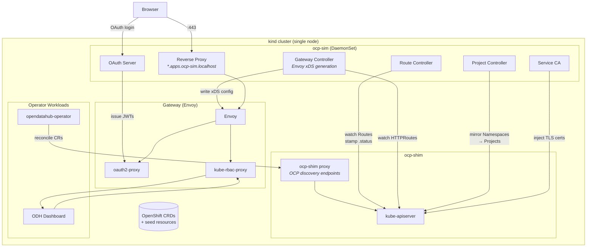

# picoshift

A lightweight OpenShift simulator that runs on [kind](https://kind.sigs.k8s.io/).
It provides just enough of the OCP control plane for operators like
[opendatahub-operator](https://github.com/opendatahub-io/opendatahub-operator)
and the ODH Dashboard to start, reconcile, and serve a working UI — all on a
single laptop with ~200 MB of RAM.



## Why

Real OpenShift clusters are heavy, slow to provision, and expensive to keep
around for day-to-day development. Most RHOAI/ODH operator code only touches a
handful of OpenShift-specific APIs. picoshift stubs those APIs with CRDs on a
plain kind cluster and runs a small Rust binary (`ocp-sim`) that handles the
dynamic parts: Route admission, Gateway API / Envoy xDS, OAuth flow, TLS
certificate injection, and Namespace → Project mirroring.

## What's in the box

| Component | What it does |
|-----------|-------------|
| **kind cluster** | Single-node Kubernetes with port mappings for 80/443/9443 |
| **ocp-shim** | Go sidecar baked into the kind node image — intercepts the API server to serve OpenShift discovery endpoints (`/apis/project.openshift.io`, `/.well-known/oauth-authorization-server`, etc.) |
| **OpenShift CRDs** | Routes, Projects, SCCs, ClusterVersion, OLM types, and more |
| **Seed resources** | ClusterVersion, Infrastructure, Ingress, Authentication, default SCCs — everything operators probe at startup |
| **ocp-sim** | Rust controller (kube-rs) running as a DaemonSet with `hostNetwork: true` |

### ocp-sim controllers

- **Route** — watches `route.openshift.io/v1` Routes, stamps `.status.ingress` with the admitted hostname
- **Gateway** — reconciles Gateway API resources, generates Envoy xDS (LDS/RDS/CDS), manages oauth2-proxy and kube-rbac-proxy sidecars
- **OAuth** — serves `/oauth/authorize` and `/oauth/token` endpoints backed by static users, issues JWTs
- **Project** — mirrors every Namespace as a `project.openshift.io/v1` Project
- **Service CA** — injects TLS certificates into annotated Services and their corresponding Secrets
- **Proxy** — reverse proxy for Route hostnames (resolves `*.apps.ocp-sim.localhost` to the right backend Service)

## Requirements

- Linux (tested on Fedora 43)
- Podman (rootful — `sudo`)
- Go 1.26+
- Rust toolchain (for building the simulator image)
- `kubectl`

## Quick start

```bash
# Clone with submodules / place source dependencies in example.src/
# (kind fork, opendatahub-operator)

# Build everything and bring up the cluster
sudo make all

# In another terminal, run the ODH operator against the cluster
make operator-run

# Create a DSC
make dsc

# Open the dashboard
# https://rh-ai.apps.ocp-sim.localhost/
```

`make all` runs the full pipeline: builds the kind fork (with ocp-shim), the
node image, the simulator container, creates the cluster, installs CRDs and
seed resources, loads the simulator, and installs ODH operator CRDs.

### Iterating

```bash
# Rebuild simulator + redeploy without recreating the cluster
make rebuild

# Hot-patch ocp-shim into the running node (no cluster recreate)
make shim-hotpatch

# Tear everything down
make teardown
```

## Project layout

```
picoshift/
├── crds/                 # OpenShift, OLM, Gateway API, Istio, monitoring CRDs
├── seed/                 # Cluster seed resources (ClusterVersion, SCCs, etc.)
├── simulator/            # Rust project — the ocp-sim binary
│   └── src/
│       ├── main.rs
│       ├── route.rs      # Route admission controller
│       ├── gateway.rs    # Gateway API → Envoy xDS
│       ├── oauth.rs      # OAuth2 token server
│       ├── project.rs    # Namespace → Project sync
│       ├── service_ca.rs # Service CA certificate injection
│       └── proxy.rs      # Reverse proxy for Route traffic
├── deploy/               # Kubernetes manifests for the simulator
├── kind/                 # kind cluster config
├── scripts/              # rebuild.sh, teardown.sh
└── Makefile
```

`example.src/` (git-ignored) holds cloned dependencies: a kind fork with the
ocp-shim, the opendatahub-operator source, and optionally the ODH Dashboard.

## How it works

1. A kind cluster starts with a custom node image that includes **ocp-shim** —
   a reverse proxy sitting between the API server and clients. It intercepts
   OpenShift-specific discovery requests so tools like `oc` and operators see
   an "OpenShift" cluster.

2. OpenShift CRDs are installed so the API server accepts resources like
   Routes, Projects, and ClusterVersions. Seed resources provide the minimal
   state operators expect at startup (cluster version, infrastructure config,
   default SCCs).

3. **ocp-sim** deploys as a DaemonSet on the control plane node. Its
   controllers watch for Routes, Gateways, and Namespaces, providing the
   dynamic behavior that operators depend on: Route admission, Envoy
   configuration, TLS certificates, and Project objects.

4. With the simulated control plane in place, the ODH operator starts, detects
   "OpenShift", and reconciles normally. The Dashboard gets a working Gateway
   with OAuth, WebSocket support, and TLS — enough to develop and test against
   without a real OCP cluster.

## Status

Early stage. The opendatahub-operator and ODH Dashboard both start and function
against picoshift. Coverage of OpenShift APIs will expand as more operators are
tested.

## License

Apache-2.0
