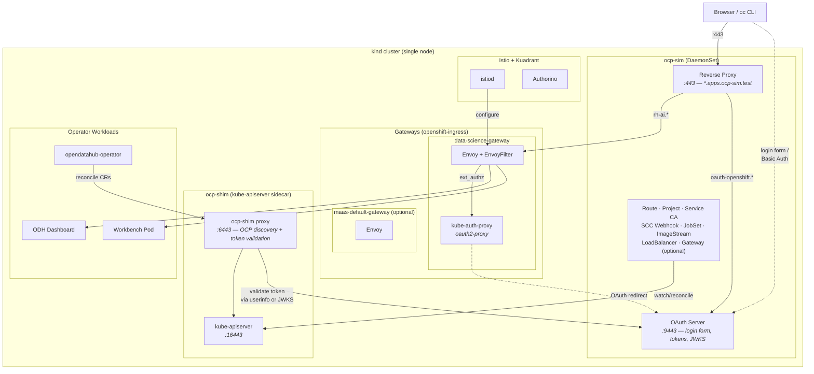
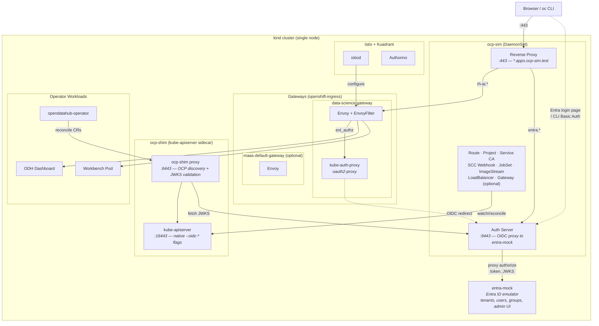

# picoshift

A lightweight OpenShift simulator that runs on [kind](https://kind.sigs.k8s.io/).
It provides just enough of the OCP control plane for operators like
[opendatahub-operator](https://github.com/opendatahub-io/opendatahub-operator)
and the ODH Dashboard to start, reconcile, and serve a working UI — all on a
single laptop with ~200 MB of RAM.

### A) Legacy / OIDC auth (`make all`)



### B) BYOIDC auth (`make all-byoidc`)



## Why

Real OpenShift clusters are heavy, slow to provision, and expensive to keep
around for day-to-day development. Most RHOAI/ODH operator code only touches a
handful of OpenShift-specific APIs. picoshift stubs those APIs with CRDs on a
plain kind cluster and runs a small Rust binary (`ocp-sim`) that handles the
dynamic parts: Route admission, Gateway API / Envoy xDS, OAuth flow, TLS
certificate injection, LoadBalancer IP assignment, and Namespace → Project
mirroring.

## What's in the box

| Component | What it does |
|-----------|-------------|
| **kind cluster** | Single-node Kubernetes with port mappings for 80/443/9443 |
| **ocp-shim** | Go sidecar baked into the kind node image — intercepts the API server on port 6443 to serve OpenShift discovery endpoints (`/apis/project.openshift.io`, `/.well-known/oauth-authorization-server`, etc.) and validate OIDC tokens via JWKS |
| **OpenShift CRDs** | Routes, Projects, SCCs, ClusterVersion, OLM types, Gateway API, JobSet, and more |
| **Seed resources** | ClusterVersion, Infrastructure, Ingress, Authentication, default SCCs, JobSet operator — everything operators probe at startup |
| **ocp-sim** | Rust controller (kube-rs) running as a DaemonSet with `hostNetwork: true` |
| **entra-mock** | Entra ID emulator — mock OIDC provider for BYOIDC mode; supports tenants, users, groups, admin UI |
| **Istio** | Service mesh with `openshift-gateway` revision — provides Gateway API data plane (Envoy) |
| **kube-auth-proxy** | oauth2-proxy deployment in `openshift-ingress` — manages browser sessions, wired into Envoy via ext_authz EnvoyFilter, redirects unauthenticated users to the OAuth/OIDC provider |
| **Kuadrant** | Authorino + Limitador for gateway auth policies and rate limiting |
| **cert-manager** | TLS certificate management for gateway listeners |

### ocp-sim controllers

- **Route** — watches `route.openshift.io/v1` Routes, stamps `.status.ingress` with the admitted hostname
- **Auth server** — serves `/oauth/authorize` (login form + Basic Auth challenge for `oc login`) and `/oauth/token`; authenticates against `users.yaml`, creates `User` and `Identity` API objects on first login, and returns per-user groups via `/oauth/userinfo`. In BYOIDC mode, proxies authorize/token/JWKS requests to the external OIDC provider (entra-mock)
- **Project** — mirrors every Namespace as a `project.openshift.io/v1` Project
- **Service CA** — injects TLS certificates into annotated Services and their corresponding Secrets
- **SCC Webhook** — mutating admission webhook that injects `fsGroup` into pods with `runAsNonRoot: true`, mimicking OCP's restricted SCC; also annotates namespaces with UID ranges
- **JobSet** — partial mock of the `jobset.x-k8s.io/v1alpha2` controller; creates real `batch/v1` child Jobs from `spec.replicatedJobs` and tracks completion status
- **ImageStream** — watches `image.openshift.io/v1` ImageStreams and populates `status.tags` from `spec.tags`, resolving `dockerImageReference` so the ODH Dashboard and notebook webhook can look up workbench images
- **LoadBalancer** — assigns node IPs to Services of type LoadBalancer, replacing the need for MetalLB on kind
- **Gateway** — built-in Gateway API controller; deploys Envoy proxies with xDS configuration for `GatewayClass`, `Gateway`, and `HTTPRoute` resources. Disabled automatically when real Istio is installed (`ENABLE_BUILTIN_GATEWAY=false`)
- **Proxy** — reverse proxy for Route and HTTPRoute hostnames (resolves `*.apps.ocp-sim.test` to the right backend Service); supports WebSocket upgrade tunneling for Jupyter kernel connections

### Auth modes

picoshift supports three authentication modes, selected via `--auth-mode`:

| Mode | Token format | How it works |
|------|-------------|-------------|
| **legacy** (default) | `sha256~` opaque | Built-in login form, token validated via `/oauth/userinfo` call per request |
| **oidc** | JWT (RS256) | Built-in OIDC provider with `.well-known/openid-configuration` and `/oauth/jwks`; ocp-shim validates tokens via JWKS |
| **byoidc** | JWT (RS256) | External OIDC provider (entra-mock, Keycloak, etc.); auth server proxies OAuth flows to the external provider; kube-apiserver validates tokens natively via `--oidc-*` flags |

In BYOIDC mode, the auth server acts as a thin proxy between the browser/CLI and the external OIDC provider. The kube-apiserver is patched with native OIDC flags so it validates JWT tokens directly — no per-request userinfo calls needed.

## Requirements

- Linux (tested on Fedora 43)
- Podman (rootful — `sudo`)
- Go 1.26+
- Rust toolchain (for building the simulator image)
- `kubectl`
- `helm` (for cert-manager and Kuadrant)
- `istioctl` (for Istio installation)

## Quick start

```bash
# Clone with submodules / place source dependencies in example.src/
# (kind fork, opendatahub-operator, odh-dashboard)

# Build everything and bring up the cluster (legacy auth)
make all

# Or: build everything with BYOIDC + Entra mock IDP
make all-byoidc

# Install the gateway stack (Istio + cert-manager + Kuadrant)
make gateway-stack

# Build and deploy the ODH operator (includes DSCI, DSC, RBAC)
make operator-install

# Create a test workbench
make workbench

# Log in via CLI (default users defined in users.yaml)
oc login --username=admin --password=admin

# Open the dashboard (browser login form)
# https://rh-ai.apps.ocp-sim.test/

# Optional: enable Models-as-a-Service
make dsc-enable-maas

# Optional: deploy model serving (SeaweedFS + KServe)
make deploy-model-serving
```

`make all` builds the kind fork (with ocp-shim), the node image, the simulator
container, creates the cluster, installs CRDs and seed resources, and deploys
the simulator. Run `make help` for a full list of targets.

### Iterating

```bash
# Rebuild simulator + redeploy without recreating the cluster
make rebuild

# Rebuild just the simulator image and restart the pod
make deploy-sim

# Hot-patch ocp-shim into the running node (no cluster recreate)
make shim-hotpatch

# Tear everything down
make teardown
```

### Workbench management

```bash
# Create a project + workbench (defaults: project1/workbench1)
make workbench

# Custom names and image
make workbench WORKBENCH_PROJECT=myproj WORKBENCH_NAME=wb1 WORKBENCH_IMAGE=jupyter-datascience-notebook:3.4
```

## Project layout

```
picoshift/
├── crds/                 # OpenShift, OLM, Gateway API, Istio, monitoring CRDs
├── seed/                 # Cluster seed resources (ClusterVersion, SCCs, etc.)
├── simulator/            # Rust project — the ocp-sim binary
│   └── src/
│       ├── main.rs
│       ├── oauth/             # Auth server (OAuth + BYOIDC proxy)
│       │   ├── mod.rs         #   entry point, request router, re-exports
│       │   ├── types.rs       #   UserStore, OAuthState, JwtKeys, constants
│       │   ├── helpers.rs     #   response builders, parsing, login form HTML
│       │   ├── handlers.rs    #   legacy OAuth handlers (authorize, token, jwks)
│       │   ├── byoidc.rs      #   BYOIDC proxy + external JWKS cache
│       │   ├── k8s.rs         #   OAuthClient, User, Identity API helpers
│       │   └── infra.rs       #   TLS config, Service/Route/CoreDNS setup
│       ├── route.rs           # Route admission controller
│       ├── gateway.rs         # Built-in Gateway API controller (optional)
│       ├── project.rs         # Namespace → Project sync
│       ├── service_ca.rs      # Service CA certificate injection
│       ├── pod_mutate.rs      # SCC-like mutating webhook + namespace UID ranges
│       ├── jobset.rs          # JobSet mock controller
│       ├── imagestream.rs     # ImageStream import controller
│       ├── loadbalancer.rs    # LoadBalancer IP assignment for kind
│       └── proxy.rs           # Reverse proxy for Route + HTTPRoute traffic
├── users.yaml            # Default OAuth users (admin, user1, developer)
├── deploy/               # Kubernetes manifests
│   ├── simulator.yaml        # ocp-sim DaemonSet
│   ├── entra-mock.yaml       # Entra ID mock OIDC provider
│   ├── seaweedfs.yaml        # Object storage for model serving
│   └── sklearn-*.yaml        # Model serving examples
├── docs/                 # Design docs and feature guides
├── scripts/              # Python/bash helper scripts
│   ├── create-workbench.py        # Create a project + workbench (replicates dashboard flow)
│   ├── patch-gatewayconfig-tls.py # Disable IDP cert verification for self-signed CA
│   ├── setup-admin-rbac.py        # Grant admin user cluster permissions
│   └── rebuild.sh                 # Full teardown + rebuild
├── bugs.odh/             # Documented upstream ODH bugs found during testing
├── kind/                 # kind cluster config
└── Makefile
```

`example.src/` (git-ignored) holds cloned dependencies: a kind fork with the
ocp-shim, the opendatahub-operator source, and optionally the ODH Dashboard.

## How it works

1. A kind cluster starts with a custom node image that includes **ocp-shim** —
   a Go reverse proxy sitting between the API server (port 16443) and clients
   (port 6443). It intercepts OpenShift-specific discovery requests so tools
   like `oc` and operators see an "OpenShift" cluster. In OIDC/BYOIDC modes,
   ocp-shim also validates JWT tokens via JWKS and injects user info into
   requests for the real kube-apiserver.

2. OpenShift CRDs are installed so the API server accepts resources like
   Routes, Projects, and ClusterVersions. Seed resources provide the minimal
   state operators expect at startup (cluster version, infrastructure config,
   default SCCs).

3. **ocp-sim** deploys as a DaemonSet on the control plane node. Its
   controllers watch for Routes, Namespaces, ImageStreams, Services, and
   JobSets, providing the dynamic behavior that operators depend on: Route
   admission, TLS certificates, Project objects, ImageStream status resolution,
   SCC-like pod mutation (fsGroup injection), LoadBalancer IP assignment,
   and JobSet child Job management.

4. **Istio + Kuadrant** provide the real Gateway API data plane. Istio runs
   with the `openshift-gateway` revision so it matches what OSSM/Sail does on
   real OpenShift. Two gateways live in `openshift-ingress`:
   - **data-science-gateway** — serves the Dashboard, workbenches, and OAuth
     callbacks (`rh-ai.apps.ocp-sim.test`). Uses **kube-auth-proxy**
     (oauth2-proxy) for browser session auth, wired via an EnvoyFilter ext_authz.
   - **maas-default-gateway** (optional, via `make deploy-maas`) — serves
     model-serving API endpoints (`maas.apps.ocp-sim.test`). Uses **Authorino**
     for API key authentication via Kuadrant AuthPolicy.

   Alternatively, the **built-in gateway controller** (`ENABLE_BUILTIN_GATEWAY=true`,
   the default) provides a lightweight Envoy-based Gateway API implementation
   that works without Istio — useful for quick iteration when the full service
   mesh isn't needed.

5. Authentication supports three modes:
   - **Legacy**: kube-auth-proxy redirects unauthenticated browser requests to
     the ocp-sim auth server, which presents a login form (or responds to
     `oc login` Basic Auth challenges). After login, it issues an opaque
     `sha256~` token. ocp-shim validates tokens by calling `/oauth/userinfo`.
   - **OIDC**: Same flow, but the auth server issues signed JWTs with OIDC
     discovery. ocp-shim validates tokens via JWKS — no per-request userinfo
     calls.
   - **BYOIDC**: The auth server proxies OAuth flows to an external OIDC
     provider (**entra-mock** in the default setup). The kube-apiserver is
     patched with native `--oidc-*` flags to validate tokens directly. This
     mirrors real OpenShift BYOIDC where the built-in OAuth server is replaced
     by an external IDP like Azure Entra ID.

   In all modes, the auth server creates `User` and `Identity` API objects on
   first login and provides per-user groups.

6. With the simulated control plane in place, the ODH operator starts, detects
   "OpenShift", and reconciles normally. The Dashboard gets a working Gateway
   with OAuth, WebSocket support, and TLS — enough to develop and test against
   without a real OCP cluster.

## What's running

Once fully deployed, the cluster runs the following workloads:

| Namespace | Component | Description |
|-----------|-----------|-------------|
| `ocp-sim` | ocp-sim DaemonSet | All simulated OCP controllers + reverse proxy |
| `entra-mock` | entra-mock Deployment | Entra ID mock OIDC provider (BYOIDC mode only) |
| `istio-system` | istiod (openshift-gateway) | Istio control plane, manages Envoy gateways |
| `cert-manager` | cert-manager | TLS certificate lifecycle management |
| `kuadrant-system` | Kuadrant operator | Authorino + Limitador for auth policies and rate limiting |
| `openshift-ingress` | data-science-gateway (Envoy) | Istio-managed gateway with ext_authz EnvoyFilter, TLS termination |
| `openshift-ingress` | kube-auth-proxy (x2) | oauth2-proxy — manages browser sessions, redirects to OAuth/OIDC for login |
| `opendatahub-operator-system` | ODH operator | Reconciles DSC/DSCI into component deployments |
| `opendatahub` | odh-dashboard (x2) | Dashboard UI (9 sidecar containers per pod) |
| `opendatahub` | notebook-controller | Upstream Kubeflow notebook controller |
| `opendatahub` | odh-notebook-controller | ODH notebook controller (webhook, RBAC, HTTPRoute) |
| `opendatahub` | kserve, kuberay, feast, trustyai, etc. | Model serving and ML platform operators |
| `opendatahub` | data-science-pipelines-operator | Pipeline orchestration |
| `opendatahub` | maas-api, maas-controller | Models-as-a-Service (optional, via `make deploy-maas`) |
| `opendatahub` | maas-postgres | MaaS backing database (optional) |
| `odh-model-registries` | model-catalog + postgres | Model registry with backing database |
| `project1` | workbench1 (StatefulSet) | Jupyter notebook + kube-rbac-proxy sidecar |

The default DataScienceCluster enables only the **dashboard** and **workbenches**
components. Additional components (KServe, model registry, pipelines, etc.) can
be enabled individually via DSC patches — e.g. `make dsc-enable-maas` turns on
Models-as-a-Service.

## Status

Early stage. The opendatahub-operator and ODH Dashboard both start and function
against picoshift. Jupyter workbenches can be created through the dashboard or
CLI, with full OAuth login, kube-rbac-proxy sidecar injection, and WebSocket
support for kernel connections. BYOIDC mode with Entra ID emulation provides
a realistic external-IDP authentication flow. Coverage of OpenShift APIs will
expand as more operators are tested.

## License

Apache-2.0
